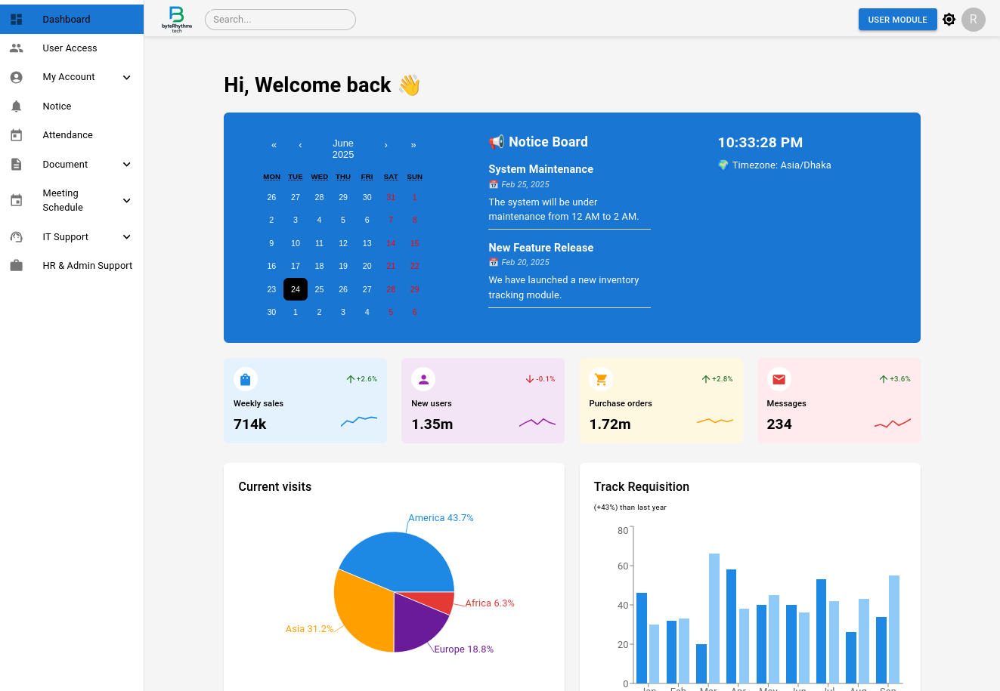
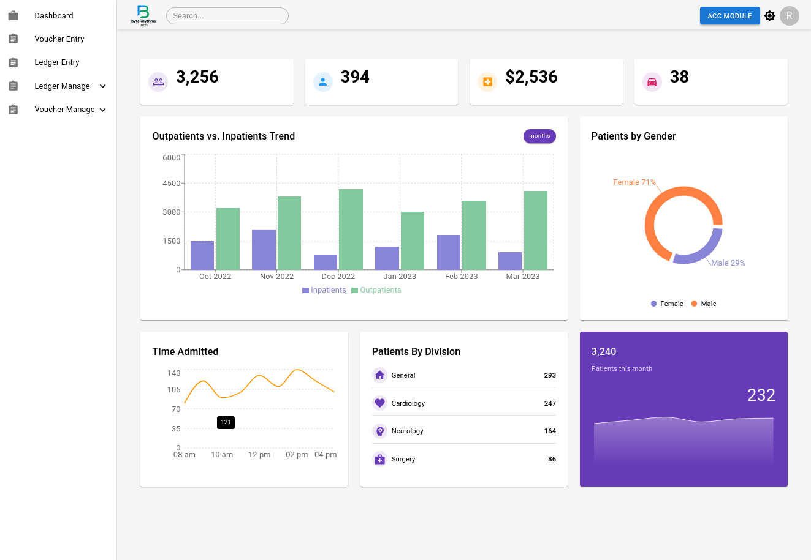

# ERP Management System

A full-featured **Enterprise Resource Planning (ERP)** web application built to streamline and automate business processes across departments such as accounting, human resources, procurement, inventory, and more.

---

## 🚀 Project Overview

This ERP system provides an integrated platform to manage:
- ✅ Employee Management
- ✅ Accounting & Finance
- ✅ Inventory Control
- ✅ Project & Task Management
- ✅ Procurement Workflow
- ✅ Document Management

Built using modern web technologies to ensure scalability, security, and performance.

---

## 🛠️ Tech Stack

**Frontend:**
- [React.js](w) (with [Vite](w) for build tool)
- [Material UI](w) (MUI) for design system
- [Framer Motion](w) for animations
- [Axios](w) for HTTP requests

**Backend:**
- [Node.js](w) with [Express.js](w)
- [MySQL](w) / [PostgreSQL](w) for relational data
- [JWT](w) for authentication
- [Multer](w) for file uploads
- [Docker](w) for containerization (optional)

---

## 📸 Screenshots

| Dashboard | Employee Module | Accounting Module |
|----------|-----------------|-------------------|
|  |  |

---

## 🔐 Features

- 🧑‍💼 Role-based user authentication
- 📄 Document upload & management
- 🧾 Real-time budget tracking
- 📦 Inventory alerts & reorder levels
- 📊 Analytical dashboards
- 📁 Cut/Copy/Paste functionality for files/folders

---

## 📂 Project Structure (Simplified)

